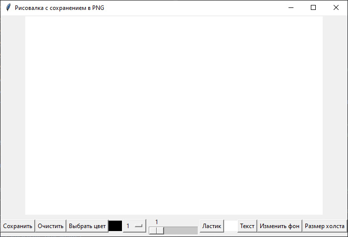
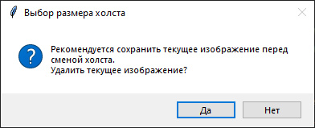
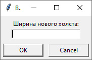
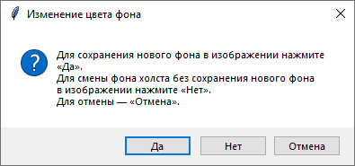
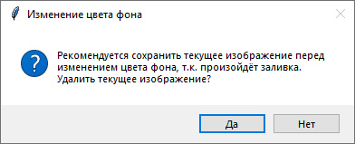

# Приложение для создания изображений с графическим интерфейсом.

## ⚙ Зависимости

Разработка и тестирование производились на стеке:


Установка библиотки:
```bash
pip install pillow
```

## 🖥 Использование

Запуск приложения производится командой
```bash
python main.py
```

### Панель управления

#### Очистить
Очистка холста.

#### Выбрать цвет
Изменение цвета кисти, используя стандартное диалоговое окно выбора цвета. По умолчанию цвет кисти чёрный.

#### Сохранить
Сохранение изображения, используя стандартное диалоговое окно сохранения файла.
Поддерживает только формат PNG. В случае успешного сохранения выводится сообщение об успешном сохранении.

#### Размер кисти
  * Выпадающий список<br>
    Установка текущего значения слайдера размера кисти, равного текущему значению выпадающего списка.
  * Слайдер<br>
    Установка текущего значения выпадающего списка размера кисти, равного текущему значению слайдера.
  
Оба элемента связаны между собой и работают синхронно.

#### Ластик
Активация/деактивация инструмента «Ластик».

По умолчанию при активации Ластика кисть меняет свой цвет на белый (цвет холста) и закрашивает (стирает) белым цветом.
Если изменить цвет кисти при активированном Ластике, то Ластик будет закрашивать выбранным цветом.
А при повторной активации выбранный цвет не сбросится. Это позволяет переключаться между двумя цветами.

#### Текст
Добавление текста на изображение.<br>
После указания строки в диалоговом окне, необходимо указать курсором место размещения текста на холсте.

#### Изменить фон
Изменение цвета фона.<br>
При нажатии кнопки, возникает диалоговое окно с выбором режима изменения фона:
1. Сохранение нового фона в изображении. Это приведёт к удалению текущего изображения. Всё изображение заменится новым
   холстом.
2. Смена фона холста без сохранения нового фона в изображении. Заменится только фон холста подобно смене темы.

#### Размер холста
Позволяет сменить холст на новый с указанием размеров. Параметры кистей сохраняются. Перед сменой холста до указания
новых размеров пользователю задаётся вопрос об уничтожении текущего изображения с рекомендацией его сохранения.
Далее по очереди пользователь указывает ширину и высоту нового холста, при этом на каждом из этапов может прервать смену
холста.

### Пипетка
Для активации Пипетки достаточно навести курсор на пиксель холста, цвет которого требуется взять,
и нажать правую кнопку мыши. Цвет кисти заменится на цвет пикселя под курсором.

### Горячие клавиши для быстрых действий
`Ctrl+S` — сохранить,<br>
`Ctrl+C` — выбрать цвет.

<div align="center">

## Скриншоты
<br>
Окно приложения с чистым холстом.

<br>
Выпадающий список выбора размера кисти.

<br>
Кнопка «Ластик» в активированном состоянии.

<br>
Вопрос об уничтожении текущего изображения с рекомендацией его сохранения.

<br>
Указание ширины нового холста.

<br>
Указание высоты нового холста.

<br>
Первое диалоговое окно «Изменение цвета фона», которое возникает при нажатии кнопки «Изменить фон».

<br>
Второе диалоговое окно «Изменение цвета фона», сменяющее первое при нажатии кнопки «Да».
</div>
