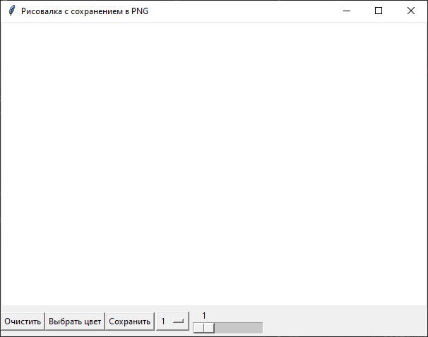
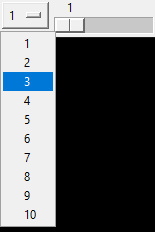

# Приложение для создания изображений с графическим интерфейсом.

## ⚙ Зависимости

Разработка и тестирование производились на стеке:


Установка библиотки:
```bash
pip install pillow
```

## 🖥 Использование

Запуск приложения производится командой
```bash
python main.py
```

<div align="center">

## Скриншоты
<br>
Окно приложения с чистым холстом.

<br>
Выпадающий список выбора размера кисти.
</div>
